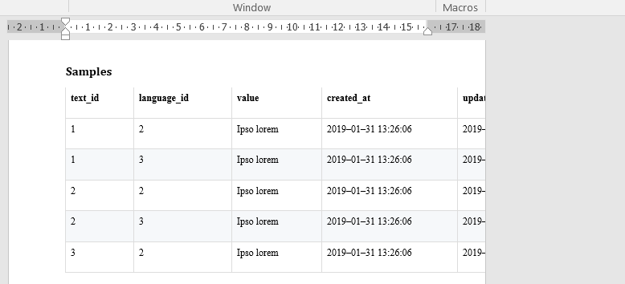
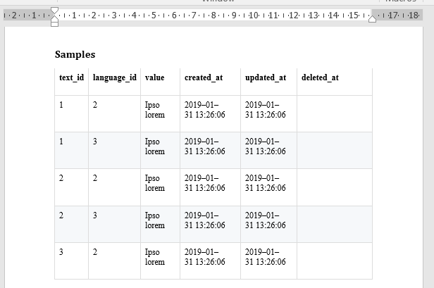

# VBA Word tips

> A few Word tips

- [ResizeTables](#resizetables)

## ResizeTables

Real world situation: you've used a tool for converting a file to the `.docx` format (like using Pandoc for converting `.md` files to Word) and it's a horror, all the paintings are too wide and overflowing the page.

You can of course resize each table one by one but when you've a lot of tables; it's not really funny.

As you can see here below, the table is really too large; we can't see all columns; we'll need to resize it.



The code here below, to copy/paste in the Word VBE window will process all tables and resize them so they will perfectly fit onto the page.

When fired, the table will now looks like this:



```vbnet
Sub ProcessTables()

Dim tbl As Table

    For Each tbl In ActiveDocument.Tables
        tbl.PreferredWidthType = wdPreferredWidthPercent
        tbl.PreferredWidth = 100
    Next tbl

End Sub
```

And not only that singe table but all tables in your current documentation.

### Before

## License

[MIT](LICENSE)
